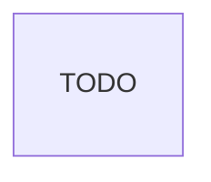

# Light Prism

TODO: add documentation here!

## Installation & Setup

Make sure you have PNPM installed:

```bash
$ npm i -g pnpm
```

In the root of the project, run:

```bash
$ pnpm install
```

You'll also want to install `turbo` globally. You can do this via:

```bash
$ pnpm install -g turbo
```

## Running

To run the server or any of the clients, you can use the `dev` command in their
`package.json`. You can do this by running

```bash
$ pnpm dev
```

inside the directory, or by running

```bash
$ pnpm --dir target dev
```

from the root, where `target` is the directory of the server/client you're trying to
run.

You can also run all the clients and server at once with:

```bash
$ turbo run dev
```

You can create new clients using the `scripts/generate-client.js` script.

## Linting

You can run all TypeScript-related lints (uses `eslint`) by running the `lint`
command for any of the specific packages in the workspace (the server and clients).

You can also parallelize and cache them by running `turbo run lint` in the root.

CSS-related lints (uses `stylelint`) are run from the root with the `stylelint`
command. You can run this command using `turbo run` as well to cache it.

File-related lints (uses `ls-lint`) are run from the root with the `ls-lint` command.
You can run this command using `turbo run` as well to cache it.

## Format

This project uses [Prettier](https://prettier.io/) for formatting.

You can format the entire repository with the `format` script in the root
`package.json`. You can check formatting using the `format:check` script.

## Spelling

Spelling is checked using CSpell. The project's dictionary lives in
`.cspell/project-words.txt`; if the spelling check fails for something that should be
ignored (because it's actually valid), you can add the word(s) to that file. VSCode's
CSpell extension also respects the dictionary, and you can add words to it using the
Editor Code Actions.

## Unused Files, Dependencies, and More

This project uses [Knip](https://knip.dev/) to check that we don't have additional
unused things.

You can check this locally using the `knip` script (which you can also run via
Turbo).

## Automation

This repository uses GitHub Actions to run linting ([ESLint](https://eslint.org/),
[Stylelint](https://stylelint.io/), [ls-lint](https://ls-lint.org/)), spelling
([CSpell](https://cspell.org/docs/getting-started/)), formatting
([Prettier](https://prettier.io/)), unused dependencies/files
([Knip](https://knip.dev/)), and build (TypeScript) checks on the project on every
pull request and push to development. It runs all of these through
[TurboRepo](https://turbo.build/repo/docs).

## Database Sketch

This is the sketch of the database, using [mermaid](https://mermaid.js.org/).

Please keep it up to date with the database as you change it.

(TODO: create the database sketch here)


# my-light-prism
